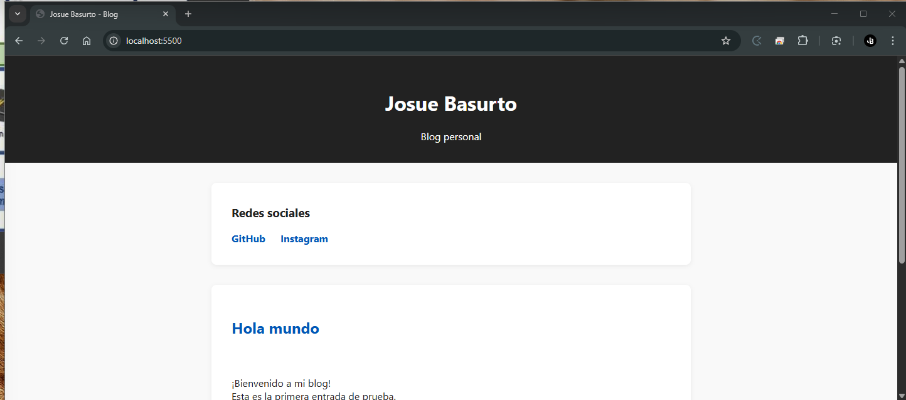

# Josue Basurto Blog

Este es el blog personal de Josue Basurto, alojado en GitHub Pages.

**URL:** [blog.josuebasurto.com](https://blog.josuebasurto.com)

---

## 🖼️ Vista previa



---

## 🚀 ¿Cómo levantar el blog localmente?

1. **Clona el repositorio:**
   ```bash
   git clone https://github.com/josuebasurto/pagesExample.git
   cd pagesExample
   ```

2. **Levanta un servidor local:**

   Con Python 3:
   ```bash
   python -m http.server 8000
   ```

   O con Node.js:
   ```bash
   npx http-server -p 8000
   ```

3. **Abre tu navegador en:**
   ```
   http://localhost:8000
   ```

---

## 📂 Estructura

- `index.html` — Página principal del blog.
- `styles.css` — Estilos básicos.
- `scripts/main.js` — Script para cargar entradas.
- `posts/` — Carpeta con las entradas en formato Markdown.

---

## ✍️ ¿Cómo agregar una nueva entrada?

1. Crea un archivo `.md` en la carpeta `posts/` (por ejemplo, `mi-nueva-entrada.md`).
2. Modifica `main.js` para cargar la nueva entrada o implementa un listado dinámico.

---

## 🌐 Redes sociales

- [GitHub](https://github.com/josuebasurto)
- [Instagram](https://instagram.com/joshbasurtomx)

---

## 🤖 Sobre este proyecto

Este proyecto fue realizado con **Vibe Coding** y [GitHub Copilot](https://github.com/features/copilot), utilizando el modelo **GPT-4.1** de OpenAI.

Si deseas más información sobre cómo se desarrolló, las herramientas utilizadas o el proceso de colaboración con IA, no dudes en contactarme o revisar la documentación de Copilot y Vibe Coding.

**Tiempo empleado de inicio a fin:** Aproximadamente 1 hora ⏱️

---

Hecho con ❤️